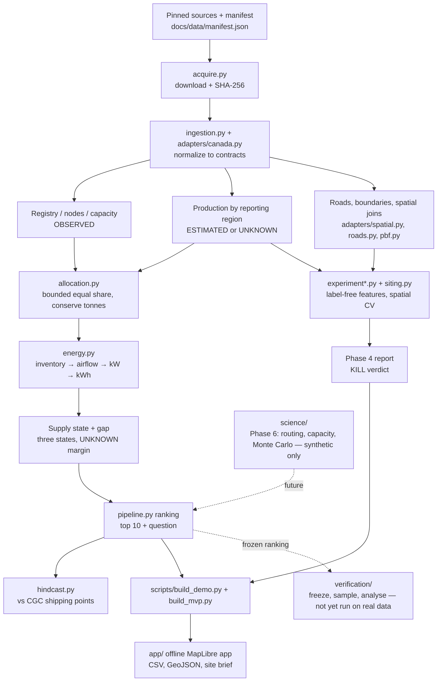

# Architecture

Rules the arrows encode: siting is a parallel branch, and allocation, capacity, energy and gap
outputs never feed it. Verification sits downstream of a frozen ranking and cannot change it.
Energy-context layers are display only. The text version is in [design.md](../design.md).

## Code map

| Path | Role | Size (lines) |
|---|---|---:|
| `src/enagis/contracts.py`, `data_contracts.py`, `pipeline_contracts.py` | Pydantic contracts with evidence labels and unit checks | 535 / 200 / 167 |
| `src/enagis/acquire.py`, `ingestion.py`, `adapters/` | Pinned acquisition, normalization, spatial joins, OSM PBF reader | 78 / 421 / ~1,400 |
| `src/enagis/allocation.py`, `energy.py`, `pipeline.py` | Phase 3 assignment, fan physics, ranking, traces | 122 / 164 / 491 |
| `src/enagis/experiment*.py`, `siting.py`, `hindcast.py` | Phase 4 registered experiment | ~1,900 |
| `src/enagis/science/` | Phase 6 engine (routing, capacity, uncertainty), synthetic only | ~1,500 |
| `src/enagis/verification/` | Phase 7 freeze, sampling, field-record analysis | ~1,000 |
| `scripts/` | App build, figures, release, preflight, catalogue, ledger, stress proposal | — |
| `web/` → `app/` | App sources → built offline application | — |
| `tests/` | 230 Python tests + 6 JS tests | — |

Line counts from `wc -l` on 9 October 2026; `src/enagis` totals 9,001 lines.

## Data contracts

Schemas: [spec/phase1-bundle.schema.json](spec/phase1-bundle.schema.json),
[spec/phase2-data.schema.json](spec/phase2-data.schema.json). Interface definitions M01–M11:
[spec/phase0-interfaces.md](spec/phase0-interfaces.md). Worked fixtures:
[tests/fixtures/README.md](../tests/fixtures/README.md).
