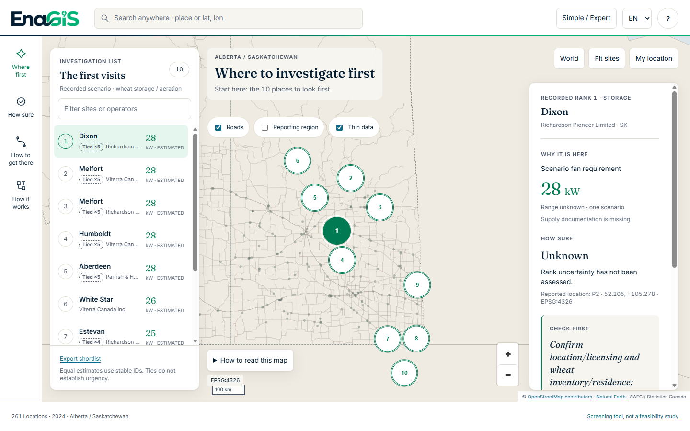
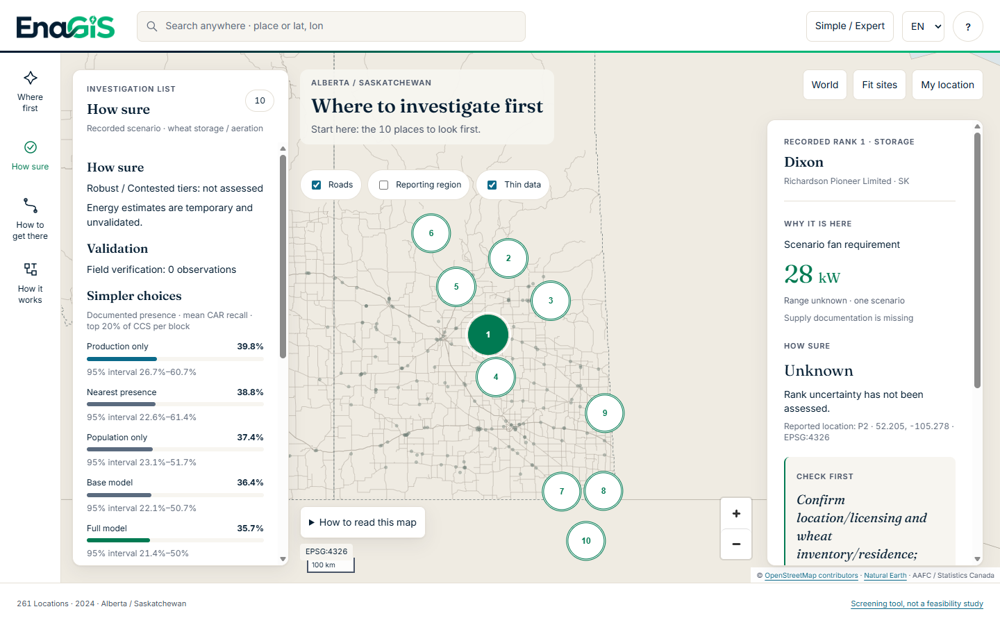
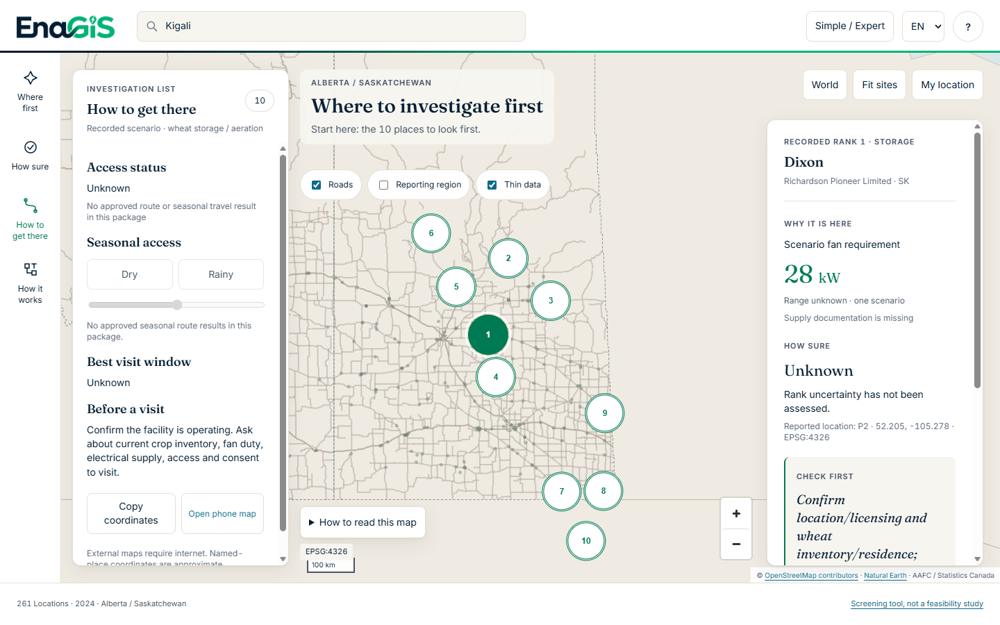
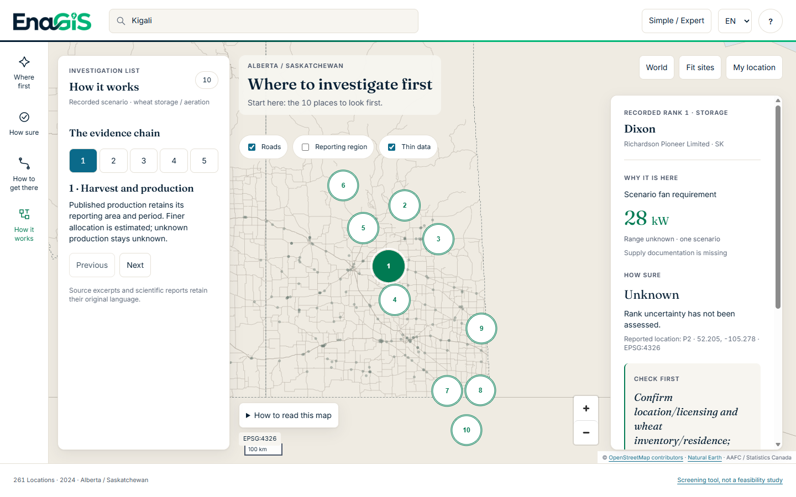
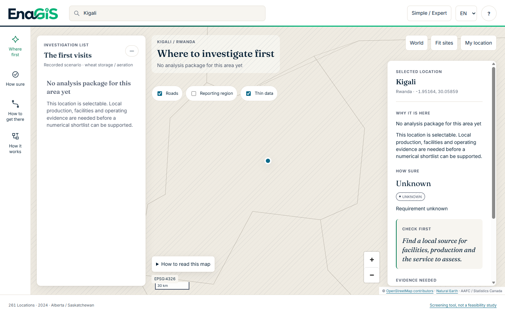
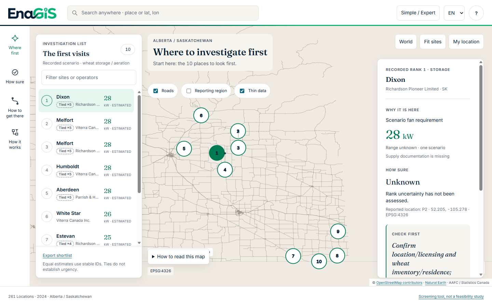
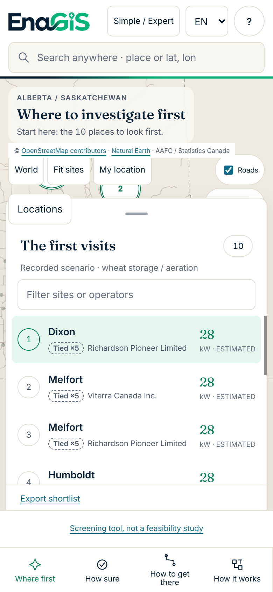

# Proof of work

Every number here was read from the repository on 9 October 2026 with the command shown.
Nothing is quoted from memory or from earlier reports.

## Data

| Fact | Value | Command / file |
|---|---|---|
| Pinned datasets | 23 (21 data spine + 2 siting covariates), each with URL, retrieval date, licence and SHA-256 | `docs/data/manifest.json`, `docs/data/phase4-manifest.json` → [data-catalogue](data-catalogue.md) |
| Restricted (never redistributed) | 5 (four CGC licensing PDFs + CGC terms page) | same |
| Raw input size | 1,002 MB | `du -sh data/raw` |
| Registry rows | 340 primary elevators: AB 89, SK 172, MB 79 | `data/processed/phase2/registry_source_rows.json` |
| Precision classes | P2 (named place): 340 of 340 | `registry.json` → `location.precision` |
| Capacity | 340 OBSERVED, unit tonne (all-commodity storage) | `capacities.json` |
| Excluded source rows | 94, with reasons | `registry_excluded.json` |
| Data artifacts verified | 32 | `python -m enagis verify-data data/processed/phase2` |

## Code and tests

| Fact | Value | Command |
|---|---|---|
| Python package `src/enagis` | 9,001 lines; modules: contracts, acquisition, ingestion, adapters (Canada, spatial, roads, PBF, licensing), allocation, energy, pipeline, experiment, siting, hindcast, science (Phase 6), verification (Phase 7) | `find src/enagis -name '*.py' \| xargs cat \| wc -l` |
| Python tests | **230 passed** in 12 files | `python -m pytest` |
| JavaScript tests | 6 passed | `node --test tests/test_view_model.cjs` |
| Smoke cases | 8 passed | `make smoke` |
| Lint / format | ruff: all checks passed | `ruff check .`, `ruff format --check .` |
| Demo browser checks | 15 passed | `node scripts/demo_preflight.mjs` |
| CI on clean runner | success on `63579eb` | https://github.com/Elie1Z/EnaGIS/actions/runs/37861220385 |
| Scientific source hash | `f2b1f09541c2…`, identical to the Phase 8 record | `python -c "from enagis.pipeline import code_hash; print(code_hash())"` |

## Pipeline stages and outputs

| Stage | Output | Verified artifacts |
|---|---|---|
| Phase 2 data spine | Registry, nodes, capacities, production, boundaries, spatial joins, outcomes, roads | 32 |
| Phase 3 pipeline | 261 nodes, 186 ranked, 10-row shortlist; 11,918,640 t known production conserved | 10 (`verify-run outputs/phase3`) |
| Phase 4 experiment | Siting arms, hindcast, report | 6 (`verify-experiment outputs/phase4`) |
| Phase 6 engine (synthetic) | 4 cases, 64 draws, 10-row shortlist; replay verified | 8 (`enagis.science verify`) |
| App | Offline application | 43 (`build_mvp --verify`) |

## Siting experiment registration and result

| Item | Value |
|---|---|
| Tag | `preregister-phase4-canada-v1.1` → commit `948cf2fddbb5a9f093883dd06b1a58a1d5a905fe` (`git ls-remote origin`) |
| Protocol SHA-256 | `ccb98f6b1f4f90d0e93335d27b9adc8887eca1e18a3069c8041a82cea61f763f` |
| Remote | https://github.com/Elie1Z/EnaGIS.git, registered 2026-10-08, before evaluation |
| Cohort | 369 CCS → 155 complete, 60 positive, 7 positive CAR blocks; 214 excluded |
| Result | Full model 35.71% vs B0 39.76% recall@top-20%; margin −4.05 pp [−39.29, −0.71] |
| Verdict | **KILL** — no demonstrated improvement from this proxy-based accessible-production feature |
| Hindcast | 52 of 138 shipping points; Phase 3 Spearman 0.773 [0.282, 0.821]; B2 found 8 of 11 top groups, Phase 3 found 4 |

Source: [audits/phase4-evaluation.json](audits/phase4-evaluation.json).

## Verification status

Real field observations: **0**. Real `ranking-v1`: **not frozen**. Committed participant: **none**.
Synthetic rehearsal: passed ([phase-7-status](phase-7-status.md)).

## Evidence labels in the app (261 development nodes)

OBSERVED 2,088 · PREDICTED 0 · ESTIMATED 744 · INFERRED 782 · UNKNOWN 562
(`python -m scripts.evidence_ledger`; details in [evidence-ledger](evidence-ledger.md)).

## History

15 commits from 7 to 9 October 2026 before this audit (`git rev-list --count 63579eb`), plus the
audit commit. Decision records: 13 files in `docs/decisions/`.

## Screenshots (captured by `scripts/demo_preflight.mjs`, headless Edge, 1440×900)

| Where first | How sure | How to get there |
|---|---|---|
|  |  |  |

| How it works | Outside the pilot (Kigali) | Flat map without WebGL | Phone, 390×844 |
|---|---|---|---|
|  |  |  |  |
